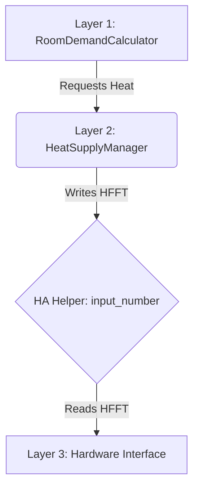

# Home Assistant Heating


First things first: Here is what your heating automation could look like.


This is a screenshot of a possible HA dashboard with two example rooms (the first four cards are hardware-specific and might and probably will look quite different on your dashboard or be even gone). 

If heating is set to `Off` (top left), it stays off; if it is set to `Party`, it stays on. However, it is the two options in between, `Auto` and `Heating`, where the magic happens.

## Requirements

This heating automation requires a [HA Climate entity](https://www.home-assistant.io/integrations/climate/) for each room, which HA creates automatically for any thermostat, or, more broadly speaking, any temperature sensor and valve combination. This is the entry point. The exit point for this automation is simply a number: 0 if no heating is required or the temperature of the heating fluid flow temperature that is to be sent through the pipelines.

## Basics

The one goal of this heating automation has been 'set up and forget'. The house ideally heats itself to the desired temperature, taking into consideration premeditated factors such as personal circumstances (work, holiday at home, gone), purpose of room, day of week, time of day, or time of year. Even factors such as the current sun exposure can play a role and can optionally be taken into consideration by this heating automation.

The present heating automation works regardless of which kind of heating system is in place; it is divided into three abstraction layers: 

(1) and (2) need not be touched, as they calculate the heating demand and the required heating fluid flow temperature (from now onwards called **HFFT**). Regarding HFFT: Every sophisticated heating automation needs controlling the HFFT at least at its most basic level, in connection to outside temperature. Besides that, the present heating automation gives the user the means to fine-tune the HFFT regarding aspects such as room delta temperature or amount of rooms to be heated.

(3) links the automation to the hardware in place and will need adjusting (unless you happen to own a Froeling Lambdatronic-powered boiler such as the SP Dual, then you can choose from the two examples provided farther down). Linking your heating hardware, however, boils down to accessing one variable only, `input_number.target_flow_temp`, which can be done in various ways such as a HA automation or an ESP.

This heating control system has been built with **AppDaemon** (Python). Why AppDaemon, you may ask. Well, AppDaemon is unparalleled when it comes to using Python within Home Assistant without restrictions, including the possibility of creating instances of classes (which, for example, PyScript cannot do). The availability of all Python libraries and possibilities allows for the ultimate straightforwardness and efficiency.

---

## Table of Contents
- [System Architecture](#-system-architecture)
- [Layer 1: Room-Level Logic](#layer-1-room-level-logic-roomdemandcalculator)
- [Layer 2: Central Control](#layer-2-central-control-heatsupplymanager)
- [Layer 3: Connection to Heating Hardware](#layer-3-connection-to-heating-hardware)

---

## 📂 Repository Structure
```text
📦 HomeAssistantHeating
├── 📂 AppDaemon
│   ├── appdaemon_watchdog.py
│   ├── apps.yaml
│   ├── globals.py
│   ├── heating_automation.py
│   ├── heating_froeling_esp.py
│   └── heating_froeling_modbus.py
├── 📂 dashboard
│   ├── dashboard_room.yaml
│   ├── dashboard_settings.yaml
│   └── heating_options.yaml
├── 📂 doc
│   └── B1200522_ModBus Lambdatronic 3200_50-04_05-19_de.pdf
├── 📂 firmware
│   └── ESP32-P4-ETH_Froeling_Lambdatronic3200.yml
└── 📂 HA
    ├── automation_climate_sync_select_bedroom.yaml
    ├── script_heating_delta_minus_input_number.yaml
    ├── script_heating_delta_plus_input_number.yaml
    ├── script_heating_minus_input_number.yaml
    ├── script_heating_plus_input_number.yaml
    └── script_heating_switch_schedules.yaml
```

---

## 🛠 System Architecture




The heating automation is split into three specialized layers; the first two are abstraction layers that can stay the same for any kind of heating, or cooling for that matter, out there. Layer 3 is all about how to address the existing heating hardware and will have to be adjusted - two examples are given.

(1) **Layer 1: Room Level (RoomDemandCalculator: The Brain):** An instance of this app runs for every room. It handles schedules, hysteresis, solar gain compensation, boost demands, and calculates the heat claim for the room.
  
(2) **Layer 2: Central Heating Control (HeatSupplyManager: The Muscle):** HeatSupplyManager acts as control center for juggling the heating demands for all rooms. Heating is initiated by writing the HFFT to the HA Helper `input_number.target_flow_temp` (heating stops by writing 0).
  
(3) **Layer 3: Hardware Interface:** Connects to the actual hardware (e.g., Froeling SP Dual): The hardware interface listens to changes to `input_number.target_flow_temp` and handles heating in accordance with the value in `input_number.target_flow_temp`. 

<details>
<summary><b>Click to expand: AppDaemon <code>apps.yaml</code> Example</b></summary>

```yaml
heating_livingroom:
  module: heating_automation
  class: RoomDemandCalculator
  dependencies: [global_config]

heat_supply_manager:
  module: heating_automation
  class: HeatSupplyManager
  dependencies:
    - global_config
    - heating_livingroom
    - heating_bedroom
  telegram_id: "-1001234536788"
```

The AppDaemon code relies on the `global_config:` section in [apps.yaml](https://github.com/franzbu/HomeAssistantHeating/blob/main/AppDaemon/apps.yaml) and the module [globals.py](https://github.com/franzbu/HomeAssistantHeating/blob/main/AppDaemon/globals.py).

In case you are wondering what the listing of the valve states is for, this is done to prevent the heating circuit pump pushing against closed valves; in case they are all closed (< 20%), heating stops.

Rooms that are only heated passively, i.e., they will never have the heating started but simply benefit from the heating up and running, are not listed in the `dependencies:` section of `heating_pump_control:`. The same, for example, goes for radiators that are heated by gravitational flow (simple physics instead of circuit pump).
</details>

<details>
<summary><b>Click to expand: Required Home Assistant Entities</b></summary>

AppDaemon gets the room names and the names of the HA Helpers based on this config, and for that it is important that the Helpers are created following the naming pattern in the section below.

Helpers to create for each room, replace 'stubbe' with the name of each of the rooms:
```text
schedule.standard_stubbe
schedule.holiday_stubbe
schedule.party_stubbe
schedule.temp_stubbe
schedule.off_stubbe

input_select.heating_schedule_stubbe: Standard, Holiday, Party, Temporary, Off, Google Calendar
input_select.default_heating_schedule_stubbe: Standard, Holiday, Party, Temporary, Off, Google Calendar (user determines default schedule each room is reset to every day at midnight)
input_select.heating_claim_stubbe

input_number.target_temp_stubbe: 5-30 (0.5 steps)
input_number.delta_temp_stubbe: 1-5 (0.5 steps) 
input_number.base_temp_stubbe: 5-30 (0.5 steps): this is the temp target_temp is set to outside of heating periods
input_number.heat_temp_stubbe: 5-30 (0.5 steps): this is the temp target_temp is set to throughout heating periods (if now overwritten by ‘temp’ in a schedule’s attribute of that specific heating period)

input_text.next_event_stubbe: for showing schedule’s attribute ‘next_event’ on dashboard

optional and only for rooms with sun compensation: input_number.sun_compensation_stubbe: 1-5 (1 steps)
```

Helpers to create once for heating automation as a whole:
```text
input_boolean.heating_automation
input_number.heating_boost_threshold (2-25)
input_number.heating_baseline_0_deg (25-45)
input_number.heating_boost_factor (0.5-4)
input_number.heating_claim_duration (0-60)
input_number.heating_margin (0-1)
input_number.max_flow_temp (20-75)
input_number.flow_temp_multi_room_offset (0-1; step: 0.1)
input_number.hk2_target_flow_temp
```
</details>

---

## Layer 1: Room-Level Logic (`RoomDemandCalculator`)

Each room functions as an independent agent. It monitors its own temperature and decides whether to "request" heat from the boiler.

You can access the code for class RoomDemandCalculator [here](https://github.com/franzbu/HomeAssistantHeating/blob/main/AppDaemon/heating_automation.py).

---

### Individual Room Settings

The beauty of Home Assistant is its modularity, meaning you can arrange your dashboard however you like. If you'd like to use the layout shown below as a starting point, you will need to install a few custom cards via HACS:

**Required HACS Cards:**
* [card-mod](https://github.com/thomasloven/lovelace-card-mod)
* [mushroom card](https://github.com/piitaya/lovelace-mushroom)
* [button-card](https://github.com/custom-cards/button-card)
* [more-info-card](https://github.com/thomasloven/lovelace-more-info-card)
* [simple swipe card](https://github.com/nutteloost/simple-swipe-card)
* *(Optional)* [Froeling Card](https://github.com/GyroGearl00se/lovelace-froeling-card) – If you have a Froeling boiler and want it to match the style at the top of this page, use this [modified version](https://github.com/franzbu/lovelace-froeling-card).

Each room is managed via a dedicated dashboard section containing the following data points:

#### Standard View

<p align="center">
  
</p>

* **Live Metrics:** Current temperature, heating valve opening percentage, and humidity.
* **Target Temp:** Current heating target temperature and the name of the active schedule.
* **Event Info:** Swipe horizontally to view detailed information regarding the current or next heating event.
* **Advanced Shortcuts:** Switching between the five schedules (Standard, Holiday, Party, Temporary, Off) can be done by swiping and long-tapping the desired schedule (a short-tap opens the edit menu). You can also use these quick long-tap shortcuts:
  * **Standard:** Long-tap the schedule's icon.
  * **Holiday:** Long-tap the temperature.
  * **Party:** Long-tap the valve state.
  * **Temporary:** Long-tap the humidity.
  * **Off:** Long-tap the remaining button.

#### Swipe Views

Swiping the upper section reveals further settings and information, including **Boost** (toggles and displays boost mode) and **Sun Compensation** (temporarily decreases target temp during solar gain).

<p align="center">
  
  
  
</p>

#### Additional Parameters

* **Heating Delta (Δ):** The "Start" trigger. Heating turns on when the temperature drops below `Target Temp - Delta`. 
  > *Control:* Tap the card/icon to adjust; long-tap for larger increments.
  
  

* **Base Temp:** The "Background" temperature used outside of scheduled heating events. This allows for passive heating to prevent the room from getting too cold.
  
  

* **Heat Temp:** The default target temperature used during active schedule events if no specific temperature is defined within the schedule itself.
  
  

#### Configuration & Setup

You can view the YAML file for an example room dashboard [here](https://github.com/franzbu/HomeAssistantHeating/blob/main/dashboard/dashboard_room.yaml). For full functionality (such as long-tapping to increase/decrease step sizes), ensure [these HA scripts](https://github.com/franzbu/HomeAssistantHeating/tree/main/HA) are installed.

To adjust this dashboard card for your specific room(s), make the following five replacements in the YAML:

1. **Heading:** Replace the single instance of `heading: Stubbe` with your room's name (spaces are allowed, e.g., `living room`).
2. **Temperature Sensor:** Replace all instances of `sensor.wall_thermostat_with_switching_output_for_brand_switches_stubbe_temperature`.
3. **Valve Sensor:** Replace the single instance of `sensor.heating_circuit_5_stubbe_valve_position`.
4. **Humidity Sensor:** Replace the single instance of `sensor.wall_thermostat_with_switching_output_for_brand_switches_stubbe_humidity`.
5. **Helper Names:** Replace the names of all Helpers. If you follow this guide's naming conventions, simply search for `stubbe` and replace it with your room's name (e.g., `livingroom` — **do not use spaces here**).

---

### 📅 Scheduling System

The schedules are the heart of the automation. The system follows the logic of the currently selected schedule to determine if heating is enabled.

#### Schedule Types
1.  **Standard:** Your everyday routine.


2.  **Holiday:** Energy-saving mode for when you are away.


3.  **Party:** Overrides timers for extended comfort.
4.  **Temporary:** Short-term adjustments.
5.  **Off:** Frost protection only (Target set to 5°C).
6.  **Google Calendar** Google Calendar can be used; it can be synced to HA via Google Apps Script and Home Assistant Automation. Name the calendars heating_room-name.

Google Apps Script:
```Python
const WEBHOOK_URL = "https://<your_ha_url>/api/webhook/gc_to_ha";

function pushToHomeAssistant(e) {
  const options = {
    'method' : 'post',
    'contentType': 'application/json',
    'payload' : JSON.stringify({
      "source": "google_apps_script",
      "action": "calendar_updated",
      "calendarId": e ? e.calendarId : "manual_test"
    }),
    'muteHttpExceptions': true    
  };

  try {
    const response = UrlFetchApp.fetch(WEBHOOK_URL, options);
    console.log("Webhook fired. Response Code: " + response.getResponseCode());
  } catch (error) {
    console.error("Failed to send webhook: " + error);
  }
} 

function setupAllHeatingTriggers() {
  // 1. Clear existing triggers so we don't create duplicates
  const triggers = ScriptApp.getProjectTriggers();
  for (let i = 0; i < triggers.length; i++) {
    ScriptApp.deleteTrigger(triggers[i]);
  }

  // 2. Find all your calendars
  const calendars = CalendarApp.getAllOwnedCalendars();
  let triggerCount = 0;
  
  // 3. Loop through them and create a trigger for the heating ones
  for (let i = 0; i < calendars.length; i++) {
    const cal = calendars[i];
    const calName = cal.getName();
    
    // Check if the calendar name starts with "heating_"
    if (calName.startsWith("heating_")) {
      ScriptApp.newTrigger("pushToHomeAssistant")
        .forUserCalendar(cal.getId())
        .onEventUpdated()
        .create();
      console.log("Successfully created trigger for: " + calName);
      triggerCount++;
    }
  }
  
  console.log("Done! Created " + triggerCount + " triggers.");
}
```

Home Assistant Automation (this is necessary for only one room):
```yaml
alias: Google Calendar Webhook Receiver
description: >-
  Catches signals from Google Apps Script to refresh heating (source Google
  Calendar, destination HA)
triggers:
  - trigger: webhook
    allowed_methods:
      - POST
      - PUT
    local_only: false
    webhook_id: gc_to_ha
conditions: []
actions:
  - action: homeassistant.reload_config_entry
    target:
      entity_id: calendar.heating_stubbe
  - delay:
      hours: 0
      minutes: 0
      seconds: 10
      milliseconds: 0
  - event: HEATING_CALENDAR_SYNC
mode: single
```

Add to Home Assistant's configuration.yaml for each room separately; substitute 'stubbe' with the names of your rooms:
```yaml
template:
  # --- STUBBE ---
  - trigger:
      - platform: time_pattern
        hours: /3
      - platform: event
        event_type: HEATING_CALENDAR_SYNC
    action:
      - action: calendar.get_events
        data:
          duration:
            days: 7
        target:
          entity_id: calendar.heating_stubbe
        response_variable: agenda
    sensor:
      - name: "Calendar Events Stubbe"
        unique_id: calendar_events_stubbe
        state: "{{ agenda['calendar.heating_stubbe']['events'] | count if agenda is defined else 0 }}"
        attributes:
          events: "{{ agenda['calendar.heating_stubbe']['events'] if agenda is defined else [] }}"
```

Make sure to install the Google Calendar integration in Home Assistant.

#### Heating Modes

`input_select.heating_modes`
1. **Off:** Heating is off and stays off
2. **Pause:** Heating is paused until midnight; at midnight it switches to `Auto`
3. **Auto:** Heating starts and stops automatically according to the room's heating demands
4. **Heating:** Currently heating, switches to `Auto` when all room drop their heating command
6. **Party:** Heating stays on until all heating circuit valves are below 15%
7. **OnFire:** (optional) heating stays on until the boiler switches off (in case user wants to avoid the boiler staying in maintenance mode)

#### Schedule Adjustment

HA's Helper Schedule can easily be set up by dragging and dropping.


Additionally, the schedule can be set by entering start and end time.


As can be seen in the screenshot above, each heating period has the option of setting a target temperature that is different from the one that is pre-set for each room; by, for example, adding `temp: 22` to `Additional data`, the target temperature for this specific heating period will be `22`°C, regardless of what the general target temp for this room is. 

So you've read above that schedules are the heart of this heating automation, but what does that actually mean? Well, schedules are THE way of starting and stopping the heating automatically, i.e., you add, for example, to the 'Standard' schedule a heating period on Monday from 6am to 10am. The heating automation then every Monday, 6am, will switch your room target temperature to the temperature you set as `heat temp` (look at the data points above). At 10am the room target temperature will be set to `base temp`. This is a so called active heating period; there is also the option for passive ones, the workings of which will be explained below. Throughout an active heating period the room will claim heating until the room target temperature minus `margin` is reached; then the heating claim is removed until the room target temperature minus delta is reached, at which point the room claims heating again.

Each room's heating claim including its requested HFFT is managed by HeatSupplyManager, which switches the heating off once there is no room left with a heating claim and keeps heating on for as long as at least one room claims heating.

In this context the above-mentioned passive heating might be of interest under certain circumstances: In case there is a room that should get heated, but should not keep the heating running of its own accord, `base temp` instead of setting `heat temp` is set to the room's maximum temperature. This keeps the heating valve for that room open and consequently gets the room heated whenever another room triggers the heating (until the maximum temperature).

### ☀️ Solar Compensation
If a room has high solar gain (e.g., south-facing windows), the automation proactively reduces the target temperature when it's warm outside. This is used as a means of compensating for the fact that with direct sun exposure the surrounding temperature can be lowered to achieve the same comfort level.

The most straightforward solution to gauge the sun's intensity is a brightness sensor; however momentary cloudiness would need to be taken into account. What turns out to be a reliable source is the temperature in a greenhouse, as long as there is one in the vicinity.

#### How the Calculation Works
The logic uses the range between 20.0°C (start) and 35.0°C (peak) to decide how much of a "discount" to apply:

* **Below 20°C Garden Temp:** The offset is 0.0. The room stays at the full target temp. 
* **At 35°C Garden Temp:** The offset is 100% of the helper value (1–5 degrees). If the helper is set to 3.0, the target temperature drops by 3.0°C once the greenhouse temperature hits 35 degrees. 
* **In between (e.g., 27.5°C):** The offset is scaled linearly (at 27.5°C, it would be 50% of the helper).

### 🔥 Boost Mode
If a room temperature is significantly below the target (e.g., after a window was left open), the room calculates a **Boost Factor**. This tells the boiler to provide much hotter water temporarily to recover the room temperature as fast as possible.

---

### Dashboard Intelligence
The system dynamically generates status messages for your Home Assistant UI:
* *“Heating starts at 06:00”*
* *“Heating stops at 22:30 tomorrow.”*
* *“Heating stops at next power cut ;)”* (For continuous 24/7 schedules).


### Safety Features
* **Health Check:** If a connection fails, the system sends an emergency Telegram notification.
* **Auto-Revert:** If **Party Mode** is active but all radiator valves have closed (meaning the house is warm), the system automatically reverts to **Auto** to save energy.

---

#### Interaction & Controls
* **Cycle Schedules:** Tap the main schedule card to cycle forward; tap the icon to cycle backward.
* **Activation:** Swipe to a schedule and **long-tap** to make it active.
* **Quick Toggle:** * Long-tap the main card to switch to **Off**. 
    * If already Off, long-tap to return to **Standard**.
* **Shortcuts:** Long-tap on temperature, valve state, or humidity to jump directly to **Holiday**, **Party**, or **Temporary** modes.
* **Visual Indicators:** A **green icon** signifies the schedule is currently active; a **gray icon** signifies it is inactive.

---

### 🎨 Status Color Guide

The dashboard uses color-coding to signal the current state of the heating demand and the central pump (HK2) status.

| Color | Logic / Condition | System State |
| :--- | :--- | :--- |
| **Red** | Heating Claim Active | Boiler in **Party** or **Extra-Heating** mode |
| **Purple** | Heating Claim Active | Boiler is currently **OFF** |
| **Orange** | No Claim + Temp < Target - 0.5 | Boiler in **Party** or **Extra-Heating** mode |
| **Green** | No Claim + Temp < Target - 0.5 | Boiler in **Automatic** mode |
| **Blue** | No Claim + Temp < Target - 0.5 | Boiler is currently **OFF** |
| **Yellow** | Current Temp > Target - 0.5 | Room is warm (Target > 5) |
| **Gray** | "No" in `next_event` text | No future heating planned (Schedule **Off**) |
| **Light Blue** | Else | Standby / Neutral |

---

### Climate device

HA's climate device is the interface between software and hardware, i.e., the present heating automation and the heating valves of the rooms. By adding thermostats (or any combination of temperature sensors and heating valves) to HA, these climate devices are autogenerated, and they link the required room temperature (of the room each one of them is assigned to) to the heating valve (or valves in case of more than one heating circuit or radiators) of that room. What this boils down to is that as long as the current room temperature is below the target temperature, the heating valve(s) will be open and close once that temperature is reached. As with the heating hardware I have dealt with so far, there is no direct way (which, BTW, would not provide any additional benefits) of targeting the opening of the valve(s), these climate devices are the way to adjust the valves and start respectively stop heating. This concept works flawlessly and without compromises.

Rather than using these, for the present purpose unnecessarily clunky, climate cards, the present heating automation uses the HA Helper `input_number.target_temp_<room>`  instead. Since, as has just been explained, thermostats with the attached valves rely on HA's climate device, each input_number is synced to its climate device (and vice versa in case the target temperature is changed on, for example, the native thermostat app). This two-way sync has been done using HA's automation, an example that can easily be adapted to all your rooms can be accessed [here](https://github.com/franzbu/HomeAssistantHeating/blob/main/HA/climate_sync_select_bedroom.yaml).

Generally speaking, it might be favorable to use local HA integrations for your heating hardware; however, also cloud-based ones will do their job. Be aware, though, that a disruption of your internet connection might have negative effects on your heating automation.

For the Homematic valves I am using an integration I use and recommend is [Homematic IP Local (HCU) Integration for Home Assistant](https://github.com/Ediminator/hacs-homematicip-hcu).

[⬆ Back to top](#table-of-contents)

---

## Layer 2: Central Control (`HeatSupplyManager`)

The central controller monitors all rooms; if at least one room is claiming heat, heating is initiated; however, this automatic heating is only enabled if `input_select.heating_mode` is not `Off` (heating stays off regardless of any room's heating claims) and not `Party` (heating stays on).

You can access the code for class HeatSupplyManager [here](https://github.com/franzbu/HomeAssistantHeating/blob/main/AppDaemon/heating_automation.py). (You will have to scroll down.)

---

### Dynamic HFFT (Heating Curve)
The system doesn't use a fixed water temperature. It calculates the **Flow Target** using a linear heating curve:

$$T_{flow} = (-Adjustment \times T_{outdoor}) + Baseline_{0^\circ C} + Boost_{max} + Offset_{multi}$$

* **Baseline:** The required HFFT when it is 0°C outside.
* **Adjustment:** The "slope" of the curve.
* **Multi-room Offset:** For every additional room asking for heat, the HFFT is nudged higher to account for increased thermal load.

`HeatSupplyManager` is responsible for calculating the base HFFT depending on the outside temperature primarily, and the amount of rooms to heat secondarily (the latter is optional and can be activated via dashboard).

The outside temperature sensor can have one or more backup sensors, just in case your friendly squirrel chews through the Dallas DS18B20 temperature sensor cable or the battery runs out of your Homematic outdoor temperature sensor.

In apps.yaml, section `temp_outdoor_map:`, any number of outdoor sensors can be listed with descending priority (first is used first). The list is dynamic, i.e., should a sensor with a higher priority start delivering valid data, AppDaemon is picking that up and switching back.

---

<details>
<summary><b>Click to expand: Main Heating Settings (Global)</b></summary>


These settings control the overall behavior of the central heating pump and HFFT calculations.

* **Heating Margin:** value determines how much before reaching target temp the room stops claiming heat
* **Claim Duration:** defaults to 0 sec.; however, change this value if you want a delay before a dashboard change takes effect (defaults to 0; however, increase this value in case you encounter temporary temperature 'jitters').
* **Boost Threshold:** Activation trigger for high-output heating. Boost starts if `Current Temp < Target Temp - Boost Threshold`.
* **Boost Factor:** Determines the HFFT increase: 
    * $$Flow\ Increase = (Target\ Temp - Current\ Temp) \times Boost\ Factor$$
* **Baseline at 0°C:** together with next parameter used for calculating HFFT; this value determines the HFFT at 0°C outside temperature
* **Baseline Adjustment:** factor by which HFFT is increased or decreased when outside temperature is below or above 0°C.
* **Max HFFT:** max temp of the HFFT, e.g., for plaster protection in wall heating
* **HFFT Multiroom Offset:** if more than one room is being heated at the same time, the HFFT is increased by `flow temp multiroom offset * (amount of rooms - 1)`
</details>

[⬆ Back to top](#table-of-contents)

---

## Layer 3: Connection to Heating Hardware

The principle is simple: HA's helper `input_number.target_flow_temp` signals heating demand when it contains the required flow temperature; it signals no heating demand if it is set to `0`. This repository contains two examples of how this can be used to connect the actual heating device, which can be a thermal heat pump, wood boiler, ... 

Depending on whether you use method (A) or (B) below, make sure to either comment out or delete the other one in apps.yaml, or, alternatively, add `disable: true  # <--- Set to true to turn off, false or remove to turn on` to the one you don't use.

### (A) Froeling wood boiler, using [ha_froeling_lambdatronic_modbus](https://github.com/GyroGearl00se/ha_froeling_lambdatronic_modbus).

As already mentioned, `FroelingHeatingModbus` in the `module heating_froeling_modbus` listens to changes made by `HeatSupplyManager` to `input_number.target_flow_temp`. `FroelingHeatingModbus` uses the HA integration [Froeling Lambdatronic Modbus](https://github.com/GyroGearl00se/ha_froeling_lambdatronic_modbus) to connect to the Froeling boiler using an ethernet to RS232 converter; more information, including examples for setting up boiler as well as converter, can be found on the integration's [homepage](https://github.com/GyroGearl00se/ha_froeling_lambdatronic_modbus).

The AppDaemon class that enables HA to read `input_number.target_flow_temp` as well as starting and stopping the heating cycles including setting the correct HFFT can be accessed [here](https://github.com/franzbu/HomeAssistantHeating/blob/main/AppDaemon/heating_froeling_modbus.py).

---

### (B) Froeling Wood Boiler - ESP32

In case you want to turn the heating's AI up a notch, you can go ESP. Instead of just being a middle-man like the solution presented in (A), the ESP is a device with its own logic and agenda, so much so that the user can access its proper web interface and schedule the heating including HFFT.

But what is the benefit in that? As far as the Froeling boiler is concerned, here is the answer: HFFT, the heat fluid flow temperature. On its own, the Froeling boiler can only base its calculations on its own outside temperature sensor. Since a well-functioning heating automating needs to go beyond that, it is essential to use another way for setting the HFFT. The ethernet-to-modbus device presented in (A) is such another way; however, there is a catch: 

> [!WARNING]
> The registers for the HFFT at -10°C and 10°C outside temperature need to be dynamically and thus continually adjusted, and while that is certainly possible, it wears out the EEPROM with its limited life span as far as writing operations are concerned.

To cut a long story short; there is another solution. Froeling enables changing the HFFT in a register of the RAM of the boiler, which means that writing to it virtually causes no wear and tear. However, Froeling has engineered this changing of the HFFT via RAM register in a way that the heating stops if the writing is not repeated within two minutes. 

While Home Assistant can certainly do this, this still means that the heating can get disrupted by a simple reboot of HA. And it is here where the ESP can play to its strengths: The firmware in this repository contains a check that once HA disconnects, the ESP switches from "Slave" to "Master" mode and keeps heating for 20 minutes (in case heating was on when HA got disconnected). Then the ESP switches to its internal schedule and starts and stops heating according to that schedule until HA reconnects, at which point the ESP automatically switches back to 'Slave' mode.

#### How All This Works

The ESP is programmed to listen to changes to HA's input_number.target_flow_temp and starts (when value is set to the required flow temp) and stops (when value is set to 0) heating accordingly. The ESP is connected to HA via ethernet (also Wifi or other wireless communication will work; however, ethernet is recommended for its reliability) and to the Froeling boiler via Modbus.


<p float="left">
    
    
</p>

The [firmware for the Waveshare ESP32-P4-ETH](https://github.com/franzbu/HomeAssistantHeating/blob/main/firmware/ESP32-P4-ETH_Froeling_Lambdatronic3200.yml) can easily be adapted to other ESPs (it contains a few lines of code for an additional irrigation valve, which can be removed if not useful). 

<p float="left">
  
  
</p>

To connect to the aforementioned Froeling SP Dual via Modbus, a TTL to RS232 converter is needed; the Waveshare Rail-Mount TTL To RS232 Galvanic Isolated Converter is a recommended choice for its interference immunity.

<p float="left">
  
</p>

As has been mentioned, the ESP's firmware can be extended with the ability to work independently from HA in a so called `Master` mode, to which it switches automatically if the connection to HA is interrupted, e.g., during maintenance work to HA. In that mode the ESP calculates the HFFT according to the settings in its own web interface (in case heating was on when the connection got disrupted, heating continues for 20 minutes with the last set HFFT) and starts and stops the heating according to its schedule ('#' ignores anything afterwards; '8-10' determines the heating period, and '@', if present, stands for the increased - or decreased in case of a negative value - HFFT; this can be used when the delta between room temp and target temp is bigger, for example, in the morning).


Seven slots (one per day of the week) are reserved for the heating schedule in Master mode (`ESP Status`), i.e., in case the ESP is disconnected from Home Assistant. 

`AppDaemon Status`, `ESP HA API Status`, and `ESP Modbus Status` show whether AppDaemon, Home Assistant, and the boiler (Modbus) are connected. `AppDaemon Status` is determined by the state of `input_boolean.appdaemon_running`, the logic of which can be found [here](https://github.com/franzbu/HomeAssistantHeating/blob/main/AppDaemon/appdaemon_watchdog.py).

`HK2 Enabled` signals that heating circuit 2 is potentially activated; however, even if `HK2 Enabled` is `off`, starting the heating procedure activates it, which is then reflected in `Heating On`.

`HK2 Flow Temp +10 (Master)` and `HK2 Flow Temp -10 (Master)` are used in `Master` mode to determine the HFFT, which is based on the boiler's outside temperature sensor, unless `Outside Temp`, which is based on a Dallas temperature sensor connected to GPIO 54, is in place, then the latter is used. `Room Temp` is for an additional dallas temperature sensor, also connected to GPIO 54 (and distinguished by its address -> make sure to change both to the values of the dallas sensors you want to use).

`Time (Manual Override)`, as already mentioned, allows for the manual adjustment of date and time in case there is no connection to the internet.

Altogether there are five temperature sensors (Dallas DS18B20) connected through 'one_wire' for outside temperature, room temperature and additional heating and solar flow temperatures; adjust the firmware according to the amount and places of the temperature sensors you want to use.

---

As mentioned, one of the reasons for using an ESP is its ability to write the target HFFT into the RAM of the boiler autonomously. However, this register (48001-48018 for Froeling's 18 heating circuits) needs to be updated within two minutes, otherwise heating stops, and the ESP automatically takes care of that - as long as the value in `input_number.target_flow_temp` is not 0, the ESP keeps poking the boiler.

Other than that, the ESP makes the boiler smart in the sense that its entities can be directly integrated into Home Assistant via ESPHome (which is already baked into HA's standard installation, so all entities in the ESP are directly available in HA).

The Froeling entities (sensors) in the ESP can easily be [changed or extended](https://github.com/franzbu/HomeAssistantHeating/blob/main/doc/B1200522_ModBus%20Lambdatronic%203200_50-04_05-19_de.pdf).

As we have established by now, the ESP directly listens to `input_number.target_flow_temp` and starts and stops heating while also setting the flow temperature. However, it might still make sense to use the optional class 
[FroelingHeatingESP](https://github.com/franzbu/HomeAssistantHeating/blob/main/AppDaemon/heating_froeling_esp.py), as it can act as a watchdog for the ESP's health and send a warning in case of an issue.

---

> [!IMPORTANT]
> For this to work, Modbus access needs to be enabled using the Froeling boiler's touchscreen by following the instructions regarding ['Enabling Modbus RTU on the Boiler'](https://github.com/GyroGearl00se/ha_froeling_lambdatronic_modbus#-enabling-modbus-rtu-on-the-boiler).

[⬆ Back to top](#table-of-contents)
